# 🐳 Docker & Kubernetes Notes

This repository contains notes and commands related to Docker and Kubernetes.

> **💡 Note:** This repository includes references to various Dockerfiles with names formatted like `Dockerfile [notes]`. When running these on your machine, be sure to remove the square brackets (`[]`) from the filename. Docker requires the file to be named exactly `Dockerfile`, without any extensions or additional characters.

## 🛠️ Manipulating Containers with `docker` CLI

### ▶️ `docker run hello-world`

Runs a test container to verify Docker installation.

```
Hello from Docker!
This message shows that your installation appears to be working correctly.
...
```

### ▶️ `docker run busybox echo 'Hello World!'`

Runs BusyBox and echoes a message.

```
Hello World!
```

### 📦 `docker create hello-world`

Creates a container without starting it.

```
a1b2c3d4e5f678901234567890abcdef1234567890abcdef1234567890abcdef
```

### 🔼 `docker start <container-id>`

Starts a container (no logs are shown).

```
a1b2c3d4e5f6
```

### 📜 `docker logs <container-id>`

Displays logs from a container.

```
Hello from Docker!
This message shows that your installation appears to be working correctly.
...
```

### 🔼📝 `docker start -a <container-id>`

Starts a container and streams its logs.

```
Hello from Docker!
This message shows that your installation appears to be working correctly.
...
```

### 📋 `docker ps`

Lists currently running containers.

```
CONTAINER ID   IMAGE         COMMAND      CREATED          STATUS          PORTS     NAMES
a1b2c3d4e5f6   busybox       "echo test"  2 minutes ago    Up 2 minutes              busy_container
```

### 📋🕑 `docker ps --all`

Lists all containers (including stopped).

```
CONTAINER ID   IMAGE         COMMAND      CREATED          STATUS                      NAMES
a1b2c3d4e5f6   hello-world   "/hello"     5 minutes ago    Exited (0) 4 minutes ago    awesome_hello
```

### 🧹 `docker system prune`

Cleans up unused data.

```
WARNING! This will remove:
   - all stopped containers
   - all networks not used by at least one container
   - all dangling images
   - all build cache

Are you sure you want to continue? [y/N] y
Deleted Containers:
a1b2c3d4e5f6

Total reclaimed space: 25.3MB
```

### 🛑 `docker stop <container-id>`

Gracefully stops a container.

```
a1b2c3d4e5f6
```

### 💀 `docker kill <container-id>`

Immediately kills a container.

```
a1b2c3d4e5f6
```

### 🏃‍♂️ `docker exec -it <container-id> <exec cmd>`

Executes a command in a running container.

```bash
bin
dev
etc
home
...
```

### 🐚 `docker exec -it <container-id> sh`

Opens a shell inside the container.

```
#
```

### 🐚▶️ `docker run -it busybox sh`

Open a shell while running the new container.

```
#
```

## 🏗️ Build Custom Images

### 🏗️ `docker build <working-dir-with-Dockerfile>`

Create new container with custom instructions.

**Example Output (with Buildkit):**

```sh
docker build .
```

```
[+] Building 7.8s (7/7) FINISHED                                                                                                      docker:desktop-linux
=> [internal] load build definition from Dockerfile                                                                                                  0.0s
=> => transferring dockerfile: 277B                                                                                                                  0.0s
=> [internal] load metadata for docker.io/library/alpine:latest                                                                                      5.7s
=> [auth] library/alpine:pull token for registry-1.docker.io                                                                                         0.0s
=> [internal] load .dockerignore                                                                                                                     0.0s
=> => transferring context: 2B                                                                                                                       0.0s
=> [1/2] FROM docker.io/library/alpine:latest@sha256:a8560b36e8b8210634f77d9f7f9efd7ffa463e380b75e2e74aff4511df3ef88c                                0.8s
=> => resolve docker.io/library/alpine:latest@sha256:a8560b36e8b8210634f77d9f7f9efd7ffa463e380b75e2e74aff4511df3ef88c                                0.0s
=> => sha256:6e771e15690e2fabf2332d3a3b744495411d6e0b00b2aea64419b58b0066cf81 0B / 3.99MB                                                            2.0s
=> => extracting sha256:6e771e15690e2fabf2332d3a3b744495411d6e0b00b2aea64419b58b0066cf81                                                             0.1s
=> [2/2] RUN apk add --update redis                                                                                                                  1.0s
=> exporting to image                                                                                                                                0.2s
=> => exporting layers                                                                                                                               0.2s
=> => exporting manifest sha256:bbf11d4ef63d252300a29b6aedba0c8c90b3ebd63f38211ed9b5e68e6a68a860                                                     0.0s
=> => exporting config sha256:3c97933bd8c21954eedac04f31baeea99bc624f1f9bcd37489793204a3bde3c0                                                       0.0s
=> => exporting attestation manifest sha256:910ad445ce9b009cc847b2774d2e429e94f7eadb6f8d0271824340952c183eba                                         0.0s
=> => exporting manifest list sha256:c5f7ff8e437e2a4857661b11ac459769c86058822fd2230dd09f842c9719f8d4                                                0.0s
=> => naming to moby-dangling@sha256:c5f7ff8e437e2a4857661b11ac459769c86058822fd2230dd09f842c9719f8d4                                                0.0s
=> => unpacking to moby-dangling@sha256:c5f7ff8e437e2a4857661b11ac459769c86058822fd2230dd09f842c9719f8d4
```

**Example Output (without Buildkit):**

```sh
DOCKER_BUILDKIT=0 docker build .
```

```
DEPRECATED: The legacy builder is deprecated and will be removed in a future release.
            BuildKit is currently disabled; enable it by removing the DOCKER_BUILDKIT=0
            environment-variable.

Sending build context to Docker daemon   98.3kB
Step 1/3 : FROM alpine
latest: Pulling from library/alpine
Digest: sha256:a8560b36e8b8210634f77d9f7f9efd7ffa463e380b75e2e74aff4511df3ef88c
Status: Downloaded newer image for alpine:latest
---> a8560b36e8b8
Step 2/3 : RUN apk add --update redis
---> Running in 7eb61f293f37
fetch https://dl-cdn.alpinelinux.org/alpine/v3.21/main/aarch64/APKINDEX.tar.gz
fetch https://dl-cdn.alpinelinux.org/alpine/v3.21/community/aarch64/APKINDEX.tar.gz
(1/1) Installing redis (7.2.8-r0)
Executing redis-7.2.8-r0.pre-install
Executing redis-7.2.8-r0.post-install
Executing busybox-1.37.0-r12.trigger
OK: 11 MiB in 16 packages
---> Removed intermediate container 7eb61f293f37
---> ad87171750c2
Step 3/3 : CMD ["redis-server"]
---> Running in fe284bc4dbca
---> Removed intermediate container fe284bc4dbca
---> 59801d109883
Successfully built 59801d109883
```

### 📄 Introduction to Dockerfile

A Dockerfile is a script containing a series of instructions to build a Docker image. It automates the process of creating containerized environments, ensuring consistency and reproducibility.

### 🧩 Basic Dockerfile Blocks:

1. 🏷️ Specify the base image.
2. ⚡ Run necessary boot scripts to the image.
3. 🏁 Define the commands to run during the container's startup.

```
# 1. Specify the base image.
FROM alpine

# 2. Run necessary boot scripts to the image.
RUN apk add --update redis

# 3. Define the commands to run during the container's startup.
CMD ["redis-server"]
```

### 🔄 Docker Build Flow

#### 🏷️ FROM

1. Already downloaded?
   1. ✅ Load from cache
1. ❌ NO!
   1. ⬇️ Download base image

#### ⚡ RUN

1. Get previous image
   1. Is this instruction in cache from current image?
      1. ✅ Load from cache
      1. 🆕 Generate new image out of it.
   1. ❌ NO!
      1. 🏗️ Create temporary container
      1. ⚡ Perform RUN instruction on that container
      1. 📸 Take a snapshot of temporary container
      1. 🆕 Generate new image out of it
      1. 🗑️ Destroy temporary container

#### 🏁 CMD

1. Get previous image
1. 🏗️ Create temporary container
1. 🏁 Perform CMD instruction on that container
1. 📸 Take a snapshot of temporary container and generate new image out of it
1. 🗑️ Destroy temporary container
1. if no more instruction
   1. 🆕 Return newly generated latest image id

#### 🔗 End to End Flow

```mermaid
flowchart TD
    %% %% Dockerfile Execution Flowchart
    %% CMD: Set command to run when container starts

    %% BLOCK NODES
    START([START])
    END([END])
    b1[FROM: base_image_name:tag]
    b2[Load base image from cache]
    b3[Download base image from DockerHub]

    b4[INSTRUCTIONS: RUN, COPY, ADD etc.]
    b5[Load INSTRUCTIONS from cache]
    b6[Create temporary container for INSTRUCTIONS]
    b7[Perform INSTRUCTIONS on temporary container]
    b8[Take snapshot of temporary container]
    b9[Destroy temporary container]

    b10[CMD: start_up_command_for_container]
    b11[Load CMD from cache]
    b12[Create temporary container for CMD]
    b13[Set CMD as start up command for temporary container]
    b14[Take snapshot of temporary container]
    b15[Destroy temporary container]

    %% CONDITION NODES
    c1{Is base image cached?}
    c2{Is INSTRUCTIONS cached from current image?}
    c3{Are there more INSTRUCTIONS?}
    c4{Is CMD cached from current image?}

    %% RETURN NODES
    r1[Generate & Return image: using this base image for below instructions]
    r2[Generate & Return image: using this base image for below instructions]
    r3[Generate & Return image: using this base image for below instructions]
    r4[Return Final Image]


    %% FLOW

    %% FROM: Get base image
    START --> b1
    b1 --> c1
    c1 -- Yes --> b2
    c1 -- No --> b3
    b2 --> r1
    b3 --> r1

    %% INSTRUCTIONS: RUN, COPY, ADD, etc.
    r1 --> b4
    b4 --> c2
    c2 -- Yes --> b5
    b5 --> r2
    c2 -- No --> b6
    b6 --> b7
    b7 --> b8
    b8 --> r2
    b8 --> b9
    r2 --> c3
    c3 -- Yes --> b4

    %% CMD: Set command to run when container starts
    c3 -- No --> b10
    b10 --> c4
    c4 -- Yes --> b11
    b11 --> r3
    c4 -- No --> b12
    b12 --> b13
    b13 --> b14
    b14 --> r3
    b14 --> b15

    %% Return final image ID
    r3 --> r4
    r4 --> END

     %% Style the return nodes
    class r1,r2,r3,r4 highlighted-yellow;

    classDef highlighted-yellow fill:#00ffff,color:#000,font-weight:bold;

    class START,END highlighted-green;

    classDef highlighted-green fill:#00ff00,color:#000,font-weight:bold;
```



### 🖼️ What? An Image Can Be Created from a Container!?

Yes, that's correct! You can create a new Docker image from any running container by specifying a start command (CMD).

To do this manually, use the following Docker CLI command:

```sh
docker commit -c 'CMD ["redis-server"]' <CONTAINER_ID>
```

### 🏷️ Can We Name (or Tag) Docker Images?

Absolutely! You can assign a name (or tag) to your Docker images using the following methods:

1. **🏷️ Tagging during build:**

   ```sh
   docker build -t sanjoke/redis:latest .
   ```

   - This command tags the image as you build it.
   - Here, `sanjoke` is your Docker Hub username, `redis` is the custom image name, and `latest` is the tag.

2. **🏷️ Tagging an existing image:**
   ```sh
   docker tag 9dfadec01 sanjoke/redis:latest
   ```
   - This command tags an already built image (referenced by its image ID or SHA).
   - You can use this to add or change tags for images after they are built.

## 🚀 Simple Project with Docker

### 🌐 Create a Web Application

1. Build a simple web app using any language or framework you like.

### 📝 Write a Dockerfile

1. Choose a base image from [Docker Hub](https://hub.docker.com/).
1. **📦 Copy your app files into the container:**  
   Example:

   ```dockerfile
   COPY ./ ./
   ```

### 🏗️ Build the Docker Image

1. Run this command to build your Docker image:

   ```
   docker build . -t sanjoke/simplewebapp:latest
   ```

### ▶️ Run the Docker Container

1. Start your app in a container:

   ```
   docker run -p 8080:5000 sanjoke/simplewebapp:latest
   ```

1. **🔌 About the `-p` flag:**  
   `-p INCOMING_PORT:CONTAINER_PORT` maps a port on your computer to the app inside the container.  
   Example: `-p 8080:5000` lets you access the app at `localhost:8080`.

### 👀 View the Web Application

1. Open your browser and go to `http://localhost:8080`.

### 📂 Set the Working Directory

1. **Set a working directory in your Dockerfile:**  
   Example:

   ```dockerfile
   WORKDIR /home/simplewebapp
   ```

### ⚡ Optimize Docker Builds with Caching

1.  If you copy all files before installing dependencies, Docker will reinstall dependencies every time any file changes:
    ```dockerfile
    COPY ./ ./
    RUN pip install -r requirements.txt
    ```
1.  To avoid unnecessary reinstalls, copy only `requirements.txt` first, install dependencies, then copy the rest:
    ```dockerfile
    COPY requirements.txt ./
    RUN pip install -r requirements.txt
    COPY ./ ./
    ```
1.  This way, Docker only reinstalls dependencies if `requirements.txt` changes, making builds faster. 🚀

## 🧩 Docker Compose Introduction

**Docker Compose** is a tool used to define and manage **multi-container Docker applications**. It allows you to describe a set of services (containers), their configurations, networks, and volumes in a single **YAML file** (`docker-compose.yml`), making it easier to develop, test, and deploy applications.

### 🎯 Scenario

#### ❓ Problem

- **Problem**: Node.js app & Redis run in **separate containers**.
- **Need**: Node.js must **connect to Redis** to read/write/display data.
- **Challenge**: How to **enable communication** between these containers?

#### 🚀 Solution 1

We could **manually run both containers** and configure the **networking settings ourselves** to allow them to communicate. However, this approach requires extra effort to manage and maintain the network configuration.

#### 🚀 Solution 2

A better approach is to use a `docker-compose.yml` file. **Docker Compose simplifies container orchestration** and automatically creates a shared network so the Node.js app and Redis container can easily connect and communicate with each other.

### 📝 Docker Compose File Explanation (Beginner Friendly)

This document explains each line of the following `docker-compose.yml` file:

```yaml
services:
  redis-server:
    image: redis
  node-app:
    build: .
    ports:
      - "4001:8081"
    restart: always
```

---

#### 🧩 `services:`

- **What it does:** Defines a group of services (containers) that will be managed by Docker Compose.
- **Why it matters:** Each service represents a separate container in your app (like a database or web server).

  ##### 🗄️ `database-server:`

  - **What it does:** This is the name of the first service (Customizable).
  - **Why it matters:** You can use this name to refer to the service in networks or from other services (e.g., in environment variables).
  - **Referance:** We can directly refer this name in our webapp code as host, **_Docker will automatically convert it into database URI_**.

    ```js
    const client = redis.createClient({
      host: "database-server",
      port: 6379,
    });
    ```

  ###### 🐳 `image: redis`

  - **What it does:** Tells Docker to use the official **Redis image** from Docker Hub.
  - **Why it matters:** This will pull and run a Redis server without needing a custom Dockerfile.

  ##### 🖥️ `webapp-server:`

  - **What it does:** This is the name of the second service (Customizable).
  - **Why it matters:** This service will be your custom Node.js application.

    ###### 🏗️ `build: .`

    - **What it does:** Tells Docker to build an image using the `Dockerfile` in the **current directory** (`.`).
    - **Why it matters:** Instead of using a prebuilt image, this builds one from your app's source code.

    ###### 🔌 `ports:`

    - **What it does:** Maps ports between your computer and the container.
    - **Why it matters:** This allows you to access the app running inside the container from your browser or other tools.

    ###### 🔢 `- "4001:8081"`

    - **What it does:** Maps **port 4001** on your computer to **port 8081** in the container.
    - **Why it matters:** You can visit `http://localhost:4001` to access the app inside the container.

    ###### 🔄 `restart: always`

    - **What it does:** Automatically restarts the container if it crashes or your computer restarts.
    - **Why it matters:** Helps keep your services running without manual intervention.
    - **Options:**
      - `no`: Never restart automatically (default).
      - `always`: Always restart.
      - `on-failure`: Restart only on non-zero exit codes.
      - `unless-stopped`: Restart unless you manually stop the container.

## 🛠️ Manipulating Containers with `docker-compose` CLI

### `docker-compose up`

➡️ **Starts and runs all services defined in the `docker-compose.yml` file.**

### `docker-compose up --build`

➡️ **Builds images before starting the containers, useful when code or Dockerfile changes.**

### `docker-compose up -d`

➡️ **Starts all services in the background (detached mode), allowing the terminal to remain free.**

### `docker-compose down`

➡️ **Stops and removes all running containers, networks, and volumes created by `up`.**

### `docker-compose ps`

➡️ **Lists the current status of all running containers managed by Docker Compose.**

Absolutely! Here's a detailed **reference and explanation document for `docker-compose.yml`** tailored to your React development setup.

---

## 📘 `docker-compose.yml` Reference for React Development

This document explains how the `docker-compose.yml` file is structured and how it helps set up a robust development environment for a React application using Docker.

---

```yaml
services:
  react-app-dev:
    build:
      context: .
      dockerfile: Dockerfile.dev
    volumes:
      - /app/node_modules
      - .:/app
    ports:
      - "3000:3000"
```

---

### 🔢 `version: '3.8'`

- Specifies the version of the Docker Compose file format.
- Version `3.8` is widely compatible with recent Docker versions and supports features like named volumes and service configuration enhancements.

---

### 🧱 `services:`

- Defines all the containerized services needed for your application.
- Here, there's only one service: `react-app-dev`.

---

### 📦 `react-app-dev:`

This is the service definition for the React development container.

#### 🏗️ `build:`

Specifies how Docker should build the image for this service.

```yaml
context: .
dockerfile: Dockerfile.dev
```

- **`context: .`** — Uses the current directory as the build context (all files are sent to Docker during build).
- **`dockerfile: Dockerfile.dev`** — Points to a custom Dockerfile optimized for development (usually contains hot-reloading and unminified code).

---

#### 📁 `volumes:`

Volumes are used to persist data or mount local files into the container.

```yaml
- /app/node_modules
- .:/app
```

- **`/app/node_modules`**
  An anonymous volume that ensures the **container maintains its own `node_modules`** directory. Yes we sync all current directory to `/app` folder inside continer in next live but except `/app/node_modules` folder.

- **`.:/app`**
  Mounts the current directory (`.`) from the host into `/app` in the container. Enables **live syncing** — changes made locally appear inside the container instantly.

> 📝 Tip: This setup ensures hot-reloading works while protecting `node_modules` from being overwritten.

---

#### 🌐 `ports:`

Maps network ports from the container to your host machine.

```yaml
- "3000:3000"
```

- Maps **port 3000** in the container (where the React dev server runs) to **port 3000** on your host.
- Allows you to access the app by visiting `http://localhost:3000` in your browser.

## 🐳 Multi-Stage Dockerfile for React App Deployment

This Dockerfile uses **multi-stage builds** to create a production-ready React app image. It first builds the app using Node.js and then serves it using Nginx.

```yml
FROM node:lts-alpine as build

WORKDIR /app

COPY package.json ./
RUN npm install

COPY ./ ./
RUN npm run build

FROM nginx:alpine
COPY --from=build /app/build /usr/share/nginx/html
```

---

### 🧱 **Stage 1: Build the React App**

```dockerfile
FROM node:lts-alpine as build
```

- **Base Image**: Uses a lightweight Node.js image (`node:lts-alpine`) to install dependencies and build the app.
- **Alias `build`**: This name (`build`) is used later to refer to this stage.

```dockerfile
WORKDIR /app
```

- **Set Working Directory**: All subsequent commands will be run inside the `/app` directory.

```dockerfile
COPY package.json ./
RUN npm install
```

- **Copy `package.json`**: Copies only `package.json` first to leverage Docker’s layer caching.
- **Install Dependencies**: Runs `npm install` to install all node modules.

```dockerfile
COPY ./ ./
RUN npm run build
```

- **Copy Source Files**: Copies the full app source into the container.
- **Build React App**: Compiles the React project into static files inside `/app/build`.

---

### 🚀 **Stage 2: Serve with Nginx**

```dockerfile
FROM nginx:alpine
```

- **Base Image**: Uses a lightweight Nginx image to serve static files efficiently in production.

```dockerfile
COPY --from=build /app/build /usr/share/nginx/html
```

- **Copy Build Output**: Copies the compiled React app from the `build` stage into the default Nginx web directory.

---

### ✅ Final Image Behavior

- The resulting image **only contains the production-ready static files and Nginx**, making it lightweight and secure.
- React app is served at the Nginx default port `80`.

## Other CLI Commands & Documents

### `docker build -f Dockerfile.dev .`

➡️ **Builds a Docker image using the development-specific Dockerfile.**

### `docker run -v $(pwd):/app <container-id>`

➡️ **Runs a container with the current directory mounted to `/app` inside the container for live code syncing.**

### `docker run -v /app/node_modules -v $(pwd):/app <container-id>`

➡️ **Runs a container while ensuring the container's `/app/node_modules` directory is preserved and not overwritten by a volume mount.**

### `docker run -v /app/node_modules -v $(pwd):/app <container-id>`

➡️ **Runs a container with the current directory mounted to `/app` and preserves the container's `/app/node_modules` to avoid overwriting with the host's version.**

### Define custom Dockerfile & update volumes in `docker-compose.yml`

```yml
services:
  react-app-dev:
    build:
      context: .
      dockerfile: Dockerfile.dev
    volumes:
      - /app/node_modules
      - .:/app
    ports:
      - "3000:3000"
```
